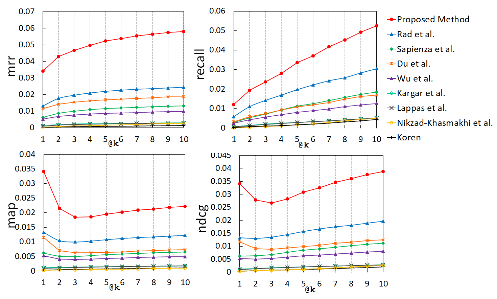
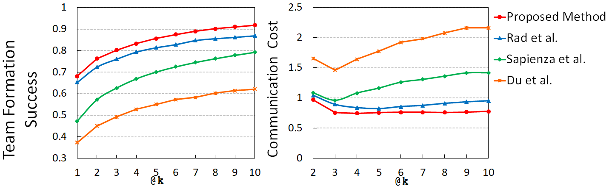
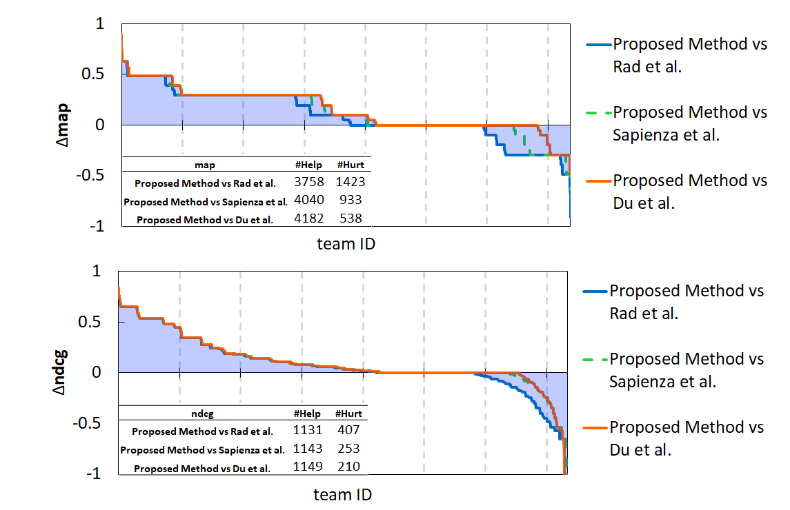

# A Neural Approach to Forming Coherent Teams in Collaboration Networks

  [](https://www.python.org/) [](http://ansicolortags.readthedocs.io/?badge=latest)


We study team formation whose goal is to form a team of experts who collectively cover a set of desirable skills. Existing approaches either result in sub-optimal teams or treat experts individually without concern for team dynamics. In this paper, we address the task of forming coherent teams and propose a neural approach that maximizes the likelihood of successful collaboration among team members while maximizing the coverage of the required skills by the team. Our extensive experiments show that the proposed approach outperforms the state-of-the-art methods in terms of both ranking and quality metrics.

## Installation

You need to install the following libraries using pip or conda command before running the codes:

```
Python 3.7+
PyTorch
NumPy
SciPy
Joblib
Tqdm
```

## Dataset

Dataset used in this is shared via Google drive. You can use this link ([Dataset](https://drive.google.com/file/d/1nEggYGuU50_T_VoElrb9FkGQmi412ga9/view?usp=sharing)) to download the dataset and this link ([Train/Test Indices](https://drive.google.com/file/d/16SSPy3dmVgvC0PSGG_3QboemTQumzz5A/view?usp=sharing)) to download the train and test indices. In order to train and evaluate our proposed model you will need both of the files. Move the files to the [dataset directory](dataset). When the preprocessed dataset is moved to the dataset folder, codes can use them without any further steps needed. Please take note that the authors of each paper are considered experts and the specializations required for a paper are its skill set.

## Usage

YOu can train/test the model by running the ***model.py*** file. Model file is also runnable from terminal by using this command:

`python model.py -method_name="custom_model_name"`

You can pass model name as an argument to the python file to store different versions of the model. For example you can change the epoch numbers and save a new model by passing a custom method name to it. Model file will read train test indices from the train/test indices provided in previous step. The prediction results for all folds will be saved to one single file in [predictions](output/predictions) folder. After running all 10 folds, you can use the output file for evaluation purposes using ranking metrics in [eval](eval) folder. Evaluation instructions are explained in detail in the next section.


## Evaluating the results

Predictions can be evaluated using the codes provided in [eval](eval) folder. All the reported numbers/charts can be reproduced by running the **"comparison.py"** python file in [eval](eval) directory.
For each of the methods, an individual csv file will be generated respectively. You can modify list of evaluating methods in the **"comparison.py"** file under the "file_names" variable. Please take note that for each of the methods, their prediction output file must be avaialble in the [predictions](output/predictions) folder under the output directory. Comparison file will generate results in [results](output/eval_results) folder. Following Information Retrieval and Qualitative metrics will appear for the desired **k**:

1. Coverage @k
2. NDCG @k
3. MAP @k
4. MRR @k
5. Skill Coverage @k
6. Communication Cost @k

Here are plots for the calculated metrics:

<p align="center">


Also, two qualitative metrics scores that reported in the paper also will be generated by running the **"comparison.py"** file. The output scores can then be used for the visualization.

<p align="center"></p>


The Help-Hurt diagrams are generated using by **"HelpHurt.py"** file in eval directory. After running the file, a csv file will be available in [eval_results](output/eval_results) folder under [output](output) directoy. You can then use the results in csv file to plot the diagrams as shown below:

<p align="center"></p>
